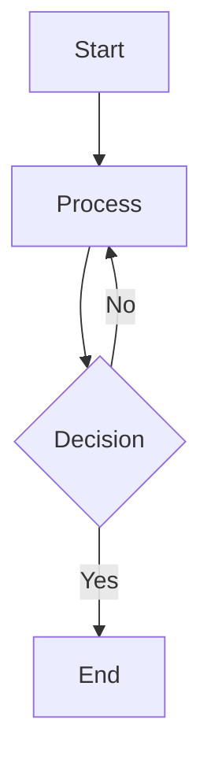

# GitHub Review Tool

A desktop application built with Tauri and React that streamlines the GitHub pull request review process. This tool provides an enhanced interface for reviewing PRs with features like local comment drafting, synchronized source/preview panes, markdown rendering with image support, and crash-resistant local storage for in-progress reviews.

## Key Capabilities

- **OAuth Authentication** - Secure GitHub login via OAuth 2.0 flow with credential storage in system keyring
- **PR Browsing & Viewing** - List and filter pull requests with pagination (100 PRs per page) and real-time search by PR number, title, or author
- **Most Recently Used (MRU) Repositories** - Dropdown menu stores up to 10 recently accessed repositories with auto-load functionality and localStorage persistence
- **Smart File Loading** - Progressive file loading prioritized by toc.yml order with background content preloading for instant file viewing
- **Enhanced Code Review** - Monaco editor integration with diff view and side-by-side source/preview panes
- **Inline Comment Creation** - Hover over line numbers to reveal "+" buttons for quick line-level commenting
- **PR-Level Comments** - View and create pull request-level (issue) comments via dedicated pane accessible from Files menu
- **Comment Count Badges** - Visual indicators on file list showing number of comments per file (includes both published and pending review comments)
- **File Viewed Tracking** - Checkbox on each file to mark as viewed with state persisted across sessions by PR
- **Auto-Navigate to Pending Review** - Automatically opens comment panel when pending review exists with no published comments
- **Offline Support** - Full offline capabilities with IndexedDB caching, automatic network detection, and graceful degradation for intermittent connectivity
- **Local Review Storage** - SQLite-backed comment drafting with automatic log file generation for crash recovery
- **Comment Management** - Create, edit, and delete comments locally before submitting to GitHub
- **Bidirectional Scroll Sync** - Synchronized scrolling between source code and markdown preview
- **Markdown Preview** - Full GitHub Flavored Markdown support with HTML rendering, repository image fetching, and Mermaid diagram rendering
- **Mermaid Diagram Support** - Client-side rendering of Mermaid diagrams in markdown files and comments
- **Renamed File Handling** - Proper support for renamed files using GitHub's `previous_filename` field to fetch base content from original path
- **Deleted File Filtering** - Automatically filters out deleted files from the file list for cleaner PR navigation
- **Batch Submission** - Submit all review comments atomically as a single GitHub review
- **Review State Management** - Support for APPROVE, REQUEST_CHANGES, COMMENT, and PENDING review states
- **Abandoned Review Tracking** - Preserve log files when reviews are cancelled for audit/email purposes
- **Log Folder Access** - Quick access to review logs via "Open Log Folder" menu item

## Project Structure

See [docs/summary.md](docs/summary.md) for a comprehensive repository map including directory structure and per-file documentation.

## Quick Start

### Prerequisites

- **Node.js** 18+ and npm
- **Rust** 1.70+ with cargo
- **Tauri CLI** - Install via `npm install -g @tauri-apps/cli`
- **GitHub OAuth App** - Register at https://github.com/settings/developers
  - Note your Client ID and Client Secret

### Setup

1. **Clone the repository**
   ```bash
   git clone https://github.com/YOUR_ORG/github-review.git
   cd github-review/app
   ```

2. **Install frontend dependencies**
   ```bash
   npm install
   ```

3. **Configure OAuth credentials**
   ```bash
   cp .env.example src-tauri/.env
   # Edit src-tauri/.env and add your GitHub OAuth credentials
   ```

4. **Build Rust backend** (optional, happens automatically on dev)
   ```bash
   cd src-tauri
   cargo build
   cd ..
   ```

### Run Development Server

```bash
npm run tauri dev
```

This starts the Vite dev server and launches the Tauri application window.

### Local Folder Mode (no PR required)

You can load a local directory of markdown files and review it in the app (useful for the scroll-sync fixtures in `tests/scroll-sync/`).

1. Launch the app: `npm run tauri dev`
2. In the **Signed in** menu, choose **Open Local Folder…**
3. Select a folder (e.g., the repo's `tests/scroll-sync/` directory)

The selected directory appears in the **Repository** panel and behaves like a normal repo selection (you can load a GitHub repo afterward to switch away from it, and re-open a local folder via the Signed in menu).

### Configuring Log Levels

The Rust backend uses the `tracing` framework for logging. By default, only warnings and errors are displayed to keep terminal output clean during development.

**Available Log Levels** (in order of verbosity):
- `error` - Only critical errors
- `warn` - Warnings and errors (default)
- `info` - Informational messages, warnings, and errors
- `debug` - Debug messages and all above
- `trace` - Most verbose, includes all log messages

**To change the log level**, set the `RUST_LOG` environment variable:

```bash
# Show all informational messages (useful for debugging)
RUST_LOG=info npm run tauri dev

# Show only errors
RUST_LOG=error npm run tauri dev

# Show debug messages
RUST_LOG=debug npm run tauri dev

# Filter to specific modules (e.g., only github module logs)
RUST_LOG=github_review::github=info npm run tauri dev
```

The default level is `warn`, which provides a good balance between visibility and noise during normal development.

### Using Inline Comments

When viewing a pull request file in the Monaco Editor:

1. **Hover** your mouse over the line numbers or glyph margin (left of line numbers)
2. A **"+" button** will appear next to the line
3. **Click the "+" button** to open the comment composer with the line number pre-filled
4. Choose to **"Post comment"** (immediate) or **"Start review"** / **"Add to review"** (pending review workflow)

### Mermaid Diagram Support

The application automatically renders Mermaid diagrams in markdown files and comments. Simply use fenced code blocks with the `mermaid` language identifier:

````markdown

````

Supported diagram types include flowcharts, sequence diagrams, class diagrams, state diagrams, entity relationship diagrams, user journey diagrams, Gantt charts, pie charts, and more. Diagrams are rendered client-side using the Mermaid library with SVG output.

### Performance & File Loading

The application uses intelligent progressive loading for optimal performance:

- **PR List**: Fetches all pull requests with pagination (100 per page) for complete history access
- **PR Search**: Real-time filtering by PR number, title, or author without re-fetching
- **File Metadata**: Loads first 50 files instantly (paths, status, additions/deletions only)
- **File Contents**: Preloads file contents progressively in the background, prioritized by `toc.yml` order
- **Smart Caching**: All file contents cached permanently per commit SHA for instant subsequent access

This approach ensures:

- File list appears in <1 second even for PRs with 100+ files
- First file click is instant (auto-selected on PR load)
- Background preloading makes subsequent clicks instant
- User can browse file list immediately while contents load silently

### Offline Support

The application provides comprehensive offline capabilities for working in environments with intermittent connectivity (e.g., airplanes, remote locations):

**Automatic Caching:**
- When a PR is opened online, all files are automatically cached in IndexedDB
- Cache includes PR details, file contents (both head and base versions), and TOC metadata
- 7-day cache expiration with automatic cleanup on application startup

**Secure Offline Authentication:**
- OAuth token remains in system keyring (secure OS-level storage)
- Last successful login cached for offline identification
- Network errors don't trigger logout (preserves workflow)
- Automatic re-authentication when network returns via multiple mechanisms:
  - Browser reconnection event detection
  - Successful query detection
  - Window focus re-validation
- `is_offline` flag in auth status indicates cached authentication
- Token validation happens on reconnection
- All API calls use real token even when offline indicators show

**Network Detection:**
- Detects both interface-level disconnections (WiFi off) and HTTP-level failures (DNS errors, server downtime)
- Visual offline indicator (red WiFi icon) appears in sidebar when offline
- Automatic reconnection detection without manual intervention

**Offline Functionality:**
- View previously loaded PRs and files from cache
- Navigate between cached files with proper ordering and naming
- Start reviews and add comments locally (stored in SQLite)
- File viewed tracking continues to work offline

**Limitations When Offline:**
- Direct comment posting disabled (single-comment POST requires network)
- PR list not cached (must be online to browse PRs)
- New PRs cannot be opened (cache only contains previously viewed PRs)

**Reconnection Behavior:**
- Network-first query strategy automatically detects when connection returns
- Moving between PRs or files triggers reconnection check
- Seamless transition back to online mode without user action

For technical details, see [offlineCache.ts documentation](docs/offlineCache.ts.md) and [useNetworkStatus.ts documentation](docs/useNetworkStatus.ts.md).

### Build for Production

To create a production-ready installer and executable for DocReviewer:

```bash
# From the app directory
npm ci
npm run tauri build
```

This will:
- Build the React frontend with Vite (optimized for production)
- Compile the Rust backend in release mode
- Bundle everything into platform-native installers (MSI and NSIS for Windows)

**Output Artifacts:**
- Executable: `src-tauri/target/release/docreviewer.exe`
- MSI installer: `src-tauri/target/release/bundle/msi/DocReviewer_<version>_x64_en-US.msi`
- NSIS installer: `src-tauri/target/release/bundle/nsis/DocReviewer_<version>_x64-setup.exe`

You can distribute the MSI or NSIS installer to users, or run the `.exe` directly for portable use.

#### Versioning
To update the app version shown in the installer and executable:
- Edit the `"version"` field in both `package.json` and `src-tauri/tauri.conf.json`
- Rebuild with `npm run tauri build`

#### Optional: Code Signing
For Windows SmartScreen compatibility, sign the output binaries using your code signing certificate and `signtool`:
```bash
signtool sign /tr http://timestamp.digicert.com /td SHA256 /fd SHA256 /a path\to\docreviewer.exe
signtool sign /tr http://timestamp.digicert.com /td SHA256 /fd SHA256 /a path\to\DocReviewer_<version>_x64-setup.exe
```

#### Troubleshooting
- If the build fails on `webview2-com`, install the [WebView2 Evergreen Runtime](https://developer.microsoft.com/en-us/microsoft-edge/webview2/).
- If the frontend does not load, confirm that the Vite build output is present at `app/dist` and that `tauri.conf.json` points to the correct `frontendDist`.

For more details, see the [Tauri production build guide](https://tauri.app/v1/guides/distribution/).
```

The executable will be in `src-tauri/target/release/`.

### Test

The project includes comprehensive test suites for both the Rust backend and React frontend.

#### Backend Tests (Rust)

```bash
cd app/src-tauri
cargo test
```

This runs 73 tests covering:
- **Error handling** (`error.rs`) - Error type creation, conversion, and serialization
- **Models** (`models.rs`) - Type serialization/deserialization and edge cases
- **GitHub API** (`github.rs`) - URL construction and parameter handling
- **Storage** (`storage.rs`) - Credential and repository state management
- **Review storage** (`review_storage.rs`) - Local review and comment persistence

#### Frontend Tests (TypeScript)

```bash
cd app
npm test              # Run tests once
npm run test:watch    # Run tests in watch mode
npm run test:coverage # Run tests with coverage report
```

This runs 66 tests covering:
- **offlineCache.ts** - IndexedDB caching for offline support
- **useNetworkStatus.ts** - Network detection and offline state management
- **useScrollSync.ts** - Bidirectional scroll synchronization between source and preview

#### Test Infrastructure

- **Backend**: Rust's built-in test framework with `#[cfg(test)]` modules
- **Frontend**: Vitest with jsdom, React Testing Library, and fake-indexeddb for IndexedDB mocking
- **Configuration**: See `app/vitest.config.ts` for frontend test configuration

## Additional Documentation

- [Repository Summary](docs/summary.md) - Complete codebase map and file documentation

## Architecture

- **Frontend**: React 19 + TypeScript + Vite
- **Backend**: Tauri 2 (Rust)
- **State Management**: TanStack Query + Zustand
- **Storage**: SQLite via rusqlite
- **Authentication**: OAuth 2.0 with system keyring integration
- **Editor**: Monaco Editor
- **Markdown**: react-markdown with rehype/remark plugins + Mermaid for diagram rendering

## License

This project is licensed under the MIT License - see the [LICENSE](LICENSE) file for details.
