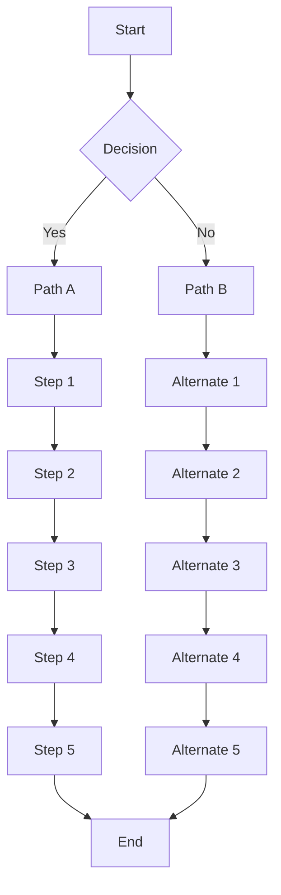
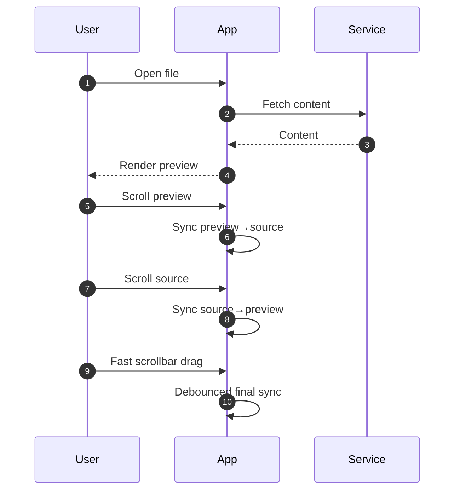
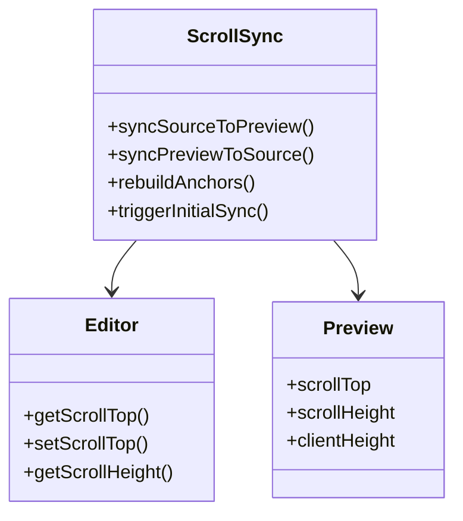

# Mermaid diagrams (scroll-sync)

This file stresses Mermaid rendering inside the markdown preview.
It includes multiple diagrams of different shapes/heights, plus text between them.

Markers:
- [[M:12.01]]

---

## [[M:12.02]] Flowchart (tall)

Paragraph after the flowchart to ensure there is content below the diagram.

- [[M:12.03]]

---

## [[M:12.04]] Sequence diagram

More text to separate diagrams.

- [[M:12.05]]

---

## [[M:12.06]] Class diagram

Final paragraph block so there is meaningful content after the last diagram.

[[M:12.07]]

Lorem ipsum dolor sit amet, consectetur adipiscing elit. Sed non risus. Suspendisse lectus tortor, dignissim sit amet, adipiscing nec, ultricies sed, dolor. Cras elementum ultrices diam. Maecenas ligula massa, varius a, semper congue, euismod non, mi.
